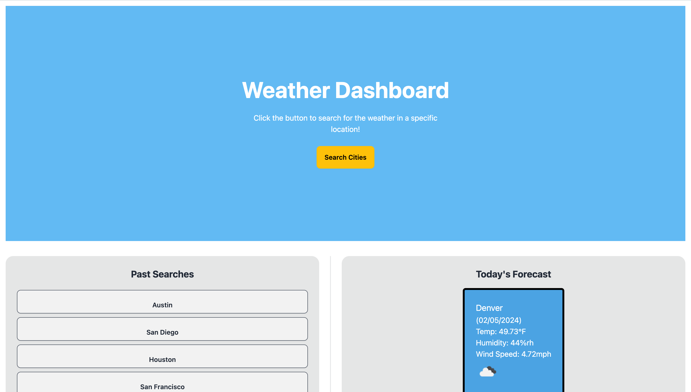
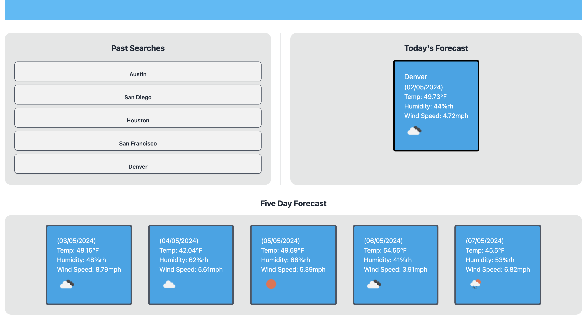

## Weather Dashboard

## Description

This application provides real-time weather information for cities around the world. You can view the current weather, as well as weather forecasts for the coming days.

## Table of Contents

- [Features](#features)
- [Usage](#usage)
- [Technologies-Used](#technologies-used)
- [License](#license)

## Features

- Get real-time weather information for any city.
- View detailed weather metrics, including temperature, humidity, and wind speed.
- Display 5-day weather forecasts.
- Search history to quickly access previously viewed cities.
- User-friendly and responsive design.

## Usage 

- Open the application in a web browser.
- Click on the 'search' button and enter a city name.
- Use the 'past searches' buttons to quickly revisit previous searches.

## Technologies-Used

- Front-End: HTML, CSS, TailWind, Daisy.
- Back-End: JavaScript
- Weather Data: [OpenWeatherMap API](https://openweathermap.org/api)

## License 

[MIT]((https://opensource.org/licenses/MIT)) 

Please refer to the [LICENSE](./LICENSE) file for more licensing information.

##

Link to live site: https://github.com/ghern5234/weather-dashboard.git

